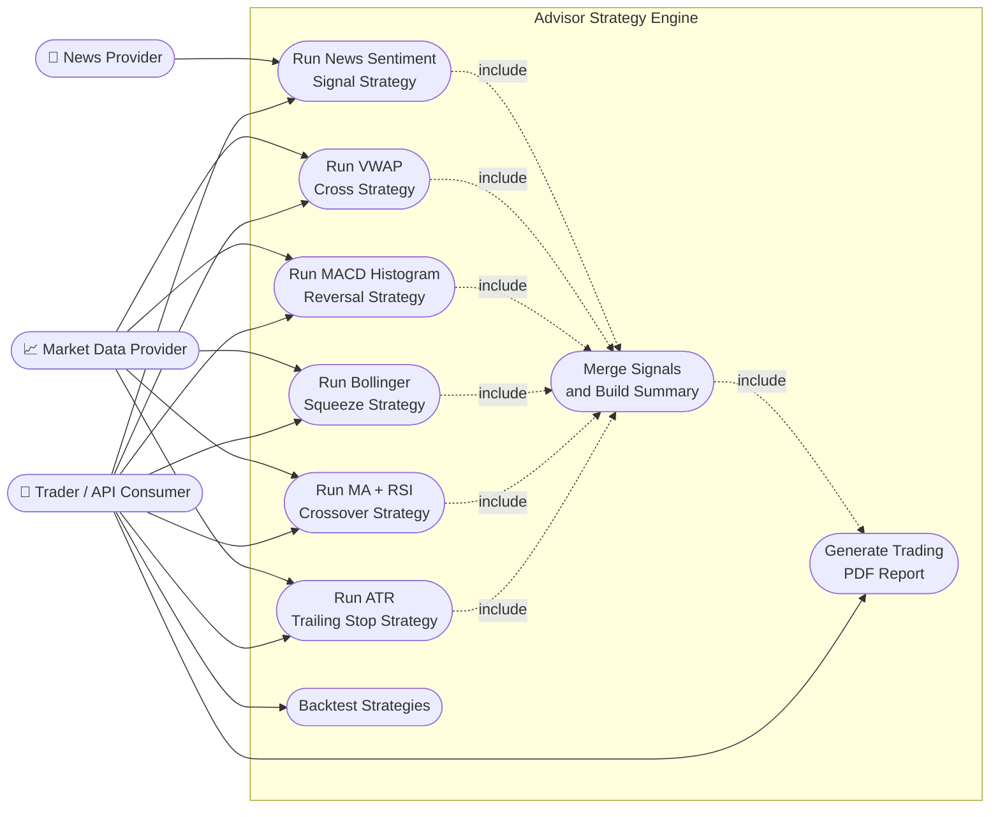
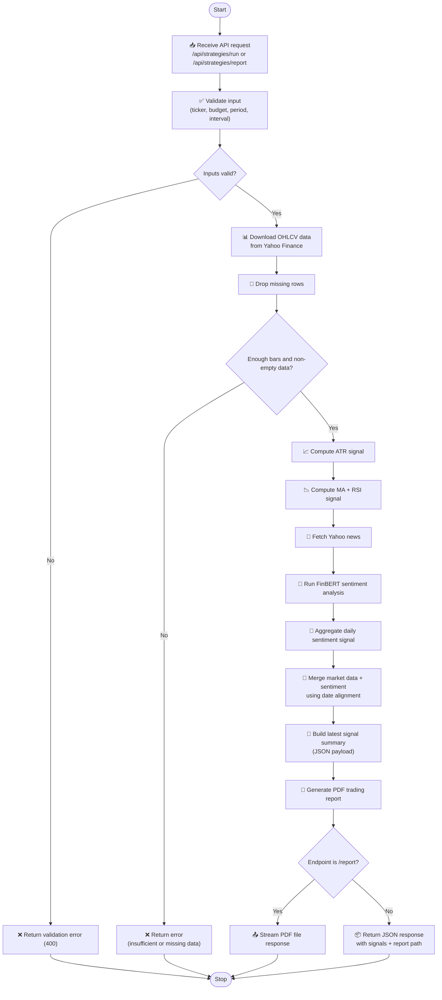

# Advisor — Trading Strategy Module

## Architecture
### Use Cases

### Flowchart 

Description of the use cases in a form of 
[Use Case diagrams](/docs/strategy_use_cases.pu)

Descrioption of main routine algorithm in terms of [Main Steps diagrams](/docsmain_steps_diagram.pu)

This document describes the functions available in `trading_strategy.py`.
---

## `to_naive_s(series)`
Normalises a datetime `Series` to tz-naive `datetime64[s]`. Strips timezone info from tz-aware (UTC) yfinance intraday timestamps so downstream date operations don't raise `TypeError`.

---

## `news_sentiment_signal(df_news, bullish_threshold, bearish_threshold)`
Aggregates per-article sentiment scores into a **daily signal**. Groups rows by date, averages the `Signed_Score`, then labels each day `Buy` (score > 0.2), `Sell` (score < -0.2), or `Hold`.

---

## `downloadData(ticker_symbol, period, interval)`
Downloads OHLCV bars from **Yahoo Finance** via `yfinance`. Validates that `period` and `interval` are legal values and that intraday intervals don't request more history than Yahoo allows. Flattens any MultiIndex columns before returning the DataFrame.

---

## `gap_fill_algorithm(data)`
Implements a **gap-fade day-trading strategy**. Detects a significant gap-down (>0.5%) between the previous close and today's open. If price then breaks above the opening-range high, it returns a `BUY` signal with an entry price, fill target (previous close), and stop-loss (opening-range low).

---

## `ma_rsi_strategy(data, ...)`
Combines **EMA crossover** (12/26 default) with **RSI** (14-period Wilder's smoothing). Signals:
- **Buy** — short EMA crosses above long EMA while RSI is not yet overbought.
- **Sell** — short EMA crosses below long EMA while RSI is not yet oversold.

---

## `bollinger_squeeze_strategy(data, ...)`
Detects **Bollinger Band squeezes** (band width compresses to a rolling minimum) then trades the breakout:
- **Buy** — squeeze releases with price breaking above the upper band.
- **Sell** — squeeze releases with price breaking below the lower band.

---

## `macd_histogram_reversal_strategy(data, ...)`
Generates signals from **MACD histogram sign changes**:
- **Buy** — histogram flips from negative to positive (momentum turning up).
- **Sell** — histogram flips from positive to negative (momentum turning down).

---

## `calculate_vwap(data)`
Calculates the **Volume-Weighted Average Price** cumulatively over the dataset. Signals on price/VWAP crossovers:
- **Buy** — close crosses above VWAP.
- **Sell** — close crosses below VWAP.

---

## `atr_trailing_stop(data, atr_period, atr_multiplier)`
Manages positions using an **ATR-based trailing stop**. Enters long when price rises more than half an ATR in a bar, enters short on a symmetric drop. The trailing stop ratchets in the direction of the trade; when price hits the stop, the position is closed with the opposing signal.

---

## `backtest_strategy(df, ...)`
A **long-only backtest engine** that replays any `Buy/Sell/Hold` signal column over historical prices. Supports:
- Transaction fees + slippage (in basis points)
- Optional cash-constrained mode (buys whole shares from a starting capital)
- Stop-loss, take-profit, and max-hold-bars exits
- Returns a dict of performance metrics: total return, CAGR, Sharpe ratio, max drawdown, win rate, profit factor, expectancy, and per-trade returns.

